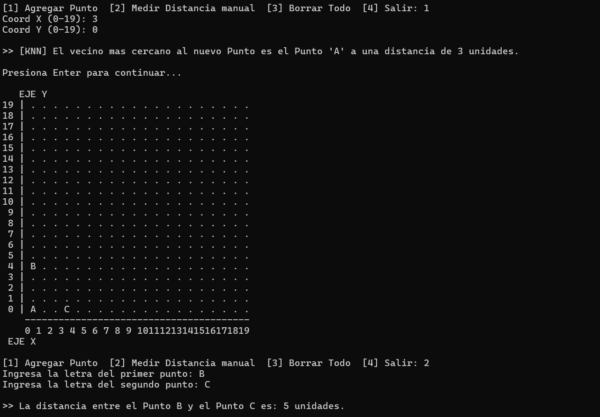

# 📍 Plano Cartesiano y Algoritmo KNN en C++

Este proyecto es una aplicación de consola en C++ que simula un plano cartesiano interactivo. Permite dibujar puntos, medir distancias y utiliza el algoritmo **KNN (K-Nearest Neighbors)** para encontrar automáticamente el vecino más cercano a un punto nuevo.

## 📸 Capturas de Pantalla

Así se ve el programa en ejecución midiendo una distancia:

## 🛠️ Cómo ejecutarlo
1. Clona este repositorio.
2. Compílalo usando g++: `g++ matrizplano.cpp -o matrizplano`
3. Ejecútalo en tu terminal: `./matrizplano`